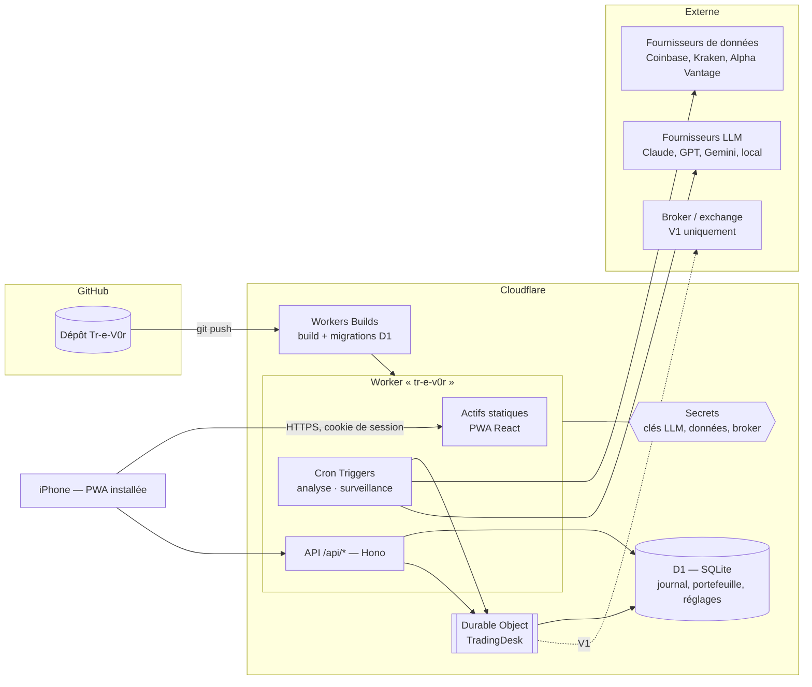
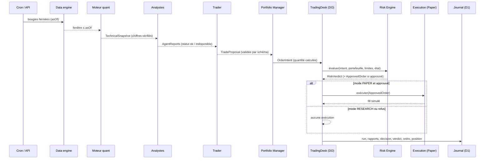

# Architecture — Tr-e-V0r

Ce document décrit l'architecture cible de l'application et la manière dont la
V0.1 s'y inscrit. Il découle de l'audit des dépôts
([`audit/00-synthese-comparative.md`](audit/00-synthese-comparative.md)).

Documents associés :

| Document | Contenu |
| --- | --- |
| [`CHOIX_TECHNIQUES.md`](CHOIX_TECHNIQUES.md) | Chaque technologie : pourquoi, inspiration, alternatives écartées |
| [`AGENTS_IA.md`](AGENTS_IA.md) | Agents, contrats, abstraction LLM (Claude, GPT, Gemini, local), autonomie |
| [`RISQUE_ET_SECURITE.md`](RISQUE_ET_SECURITE.md) | Risk Engine, kill switch, modes, authentification, secrets |
| [`BACKTESTING.md`](BACKTESTING.md) | Méthodologie, segments TRAIN/VALIDATION/TEST/OOS, biais évités |
| [`ROADMAP.md`](ROADMAP.md) | V0.1 → V1 : ce qui est fait, ce qui est prévu |

---

## 1. Principe directeur : quatre rôles qui ne se mélangent pas

```
┌──────────────────┐   ┌────────────────────┐   ┌──────────────────┐   ┌────────────────────┐
│  MOTEUR QUANT    │   │        IA          │   │   RISK ENGINE    │   │  EXECUTION ENGINE  │
│  calcule         │──►│  interprète        │──►│  impose          │──►│  réalise           │
│  mesure          │   │  raisonne          │   │  calcule         │   │  vérifie           │
│  backteste       │   │  propose           │   │  peut REFUSER    │   │  communique avec   │
│  valide          │   │  compare scénarios │   │  seul à approuver│   │  la venue          │
└──────────────────┘   └────────────────────┘   └──────────────────┘   └────────────────────┘
   code déterministe      LLM (ou règles)          code déterministe       code déterministe
```

Trois garanties structurelles, pas seulement conventionnelles :

1. **Le LLM ne produit que des données.** Il renvoie une `TradeProposal` validée
   par schéma. Il n'a aucun outil, aucun accès réseau, aucune fonction d'exécution.
2. **Seul le Risk Engine fabrique un `ApprovedOrder`.** Le type est « marqué »
   (branded type TypeScript) et son constructeur n'est pas exporté hors du module
   `core/risk`. L'Execution Engine refuse tout autre type. Le contournement est
   donc une **erreur de compilation**, pas seulement une règle de revue.
3. **Toutes les propositions passent par un point unique et sérialisé** : le
   Durable Object `TradingDesk`. Il tient l'état du kill switch et traite les
   propositions une par une, pour qu'aucune course entre deux décisions ne
   dépasse une limite.

Ces principes viennent de NautilusTrader (RiskEngine entre stratégie et
exécution) et de Condor (le LLM agit via des actions contraintes, interceptées
par le risque).

---

## 2. Vue d'ensemble du déploiement



| Brique | Rôle | Pourquoi |
| --- | --- | --- |
| **Worker unique** | Sert la PWA, l'API et les tâches planifiées | Un seul déploiement, comme BoxingCoach |
| **Actifs statiques** | Build Vite de la PWA | Même mécanisme que BoxingCoach (`wrangler.jsonc` → `assets`) |
| **D1** | Base SQL : utilisateurs, sessions, réglages, bougies en cache, runs, rapports d'agents, décisions, verdicts, ordres, positions, equity, événements | Requêtes relationnelles pour le journal et les statistiques |
| **Durable Object `TradingDesk`** | Point de passage unique et sérialisé des propositions ; état du kill switch et du mode | D1 n'offre pas de transaction interactive ; KV est éventuellement cohérent. Un DO garantit l'ordre et la cohérence forte |
| **Cron Triggers** | Cycle d'analyse ; surveillance des positions (stops, objectifs, horizon, drawdown) | L'agent travaille quand l'iPhone est verrouillé |
| **Secrets** | Clés API (LLM, données, broker), jeton d'installation | Jamais dans le frontend ni dans Git |

**Ce que nous n'utilisons pas (encore), et pourquoi :**

- **KV** : cohérence éventuelle (jusqu'à 60 s), inadaptée à un kill switch.
- **Queues** : utiles quand le nombre d'actifs dépassera la limite CPU d'une
  invocation (V0.4).
- **R2** : pour les artefacts volumineux (backtests longs, archives de prompts), V0.3+.
- **AI Gateway** : journalisation et plafonds de coût LLM côté Cloudflare, envisagé en V0.2.
- **Cloudflare Access** : protection supplémentaire optionnelle devant l'application (voir sécurité).

---

## 3. Flux de bout en bout

La chaîne demandée (données → … → amélioration), avec le module qui porte chaque étape :

```
DONNÉES DE MARCHÉ          server/data/*            fournisseurs (Coinbase, Kraken, Alpha Vantage)
      ↓
DATA ENGINE                server/data/candle-store  cache D1, bougies FERMÉES uniquement, fraîcheur
      ↓
FEATURE ENGINEERING        core/quant                indicateurs, régimes, niveaux (déterministe)
      ↓
MULTI-AGENTS IA            core/agents + server/agents
  ├─ ANALYSE TECHNIQUE        Technical Analyst  (LLM ou règles)          ✅ V0.1
  ├─ ANALYSE FONDAMENTALE     Fundamental Analyst                          ⏳ V0.2 (indisponible, déclaré)
  ├─ ANALYSE SENTIMENT        Sentiment Analyst                            ⏳ V0.2 (indisponible, déclaré)
  └─ ANALYSE MACRO            Macro Analyst                                ⏳ V0.2 (indisponible, déclaré)
      ↓
SYNTHÈSE / CONSENSUS       core/agents/consensus      agrégation pondérée des avis disponibles
      ↓
TRADER AGENT               Trader (LLM ou règles)     TradeProposal : action, entrée, stop, objectif,
      ↓                                               horizon, confiance, scénarios, facteurs
PORTFOLIO MANAGER          core/portfolio             exposition cible → quantité (risque fixe)
      ↓
RISK MANAGER               core/risk  (dans le DO)    ~20 règles ; APPROUVÉ / RÉDUIT / REFUSÉ
      ↓
DÉCISION                   journal D1                 tout est enregistré, même un refus
      ↓
BACKTEST / PAPER TRADING   core/sim + core/backtest   même simulateur de fills pour les deux
      ↓
EXÉCUTION                  server/execution           PaperVenue (V0.1) ; venue réelle (V1)
      ↓
OBSERVATION DU RÉSULTAT    server/jobs/monitor        stops, objectifs, horizon, mark-to-market
      ↓
MÉMOIRE                    D1 : decisions, fills, positions, equity, events
      ↓
ÉVALUATION                 core/backtest/metrics      Sharpe, drawdown, profit factor… ; fiabilité par
      ↓                                               régime et confiance (V0.3)
AMÉLIORATION               labo hors ligne (V1+)      toute optimisation validée hors échantillon
```

### 3.1 Cycle d'analyse (cron ou manuel)



### 3.2 Surveillance (cron, toutes les 15 minutes)

1. Récupérer le dernier prix pour chaque position ouverte.
2. Appliquer la **triple barrière** (Hummingbot) : stop-loss, objectif, horizon.
   Si stop et objectif sont touchés dans la même bougie, **le stop est réputé
   touché d'abord** (hypothèse pessimiste, voir Nautilus).
3. Valoriser le portefeuille et écrire un point d'equity.
4. Vérifier la perte journalière (passage automatique en `REDUCING`) et le
   drawdown maximal (passage automatique en `HALTED`).
5. Écrire les alertes.

---

## 4. Arborescence

```
Tr-e-V0r/
├── docs/                       audit, architecture, choix, sécurité, backtesting, roadmap
├── migrations/                 migrations SQL D1 (versionnées)
├── public/                     manifeste PWA, icônes, service worker, _headers (CSP)
├── src/
│   ├── core/                   DOMAINE PUR — aucune I/O, ni React, ni D1, ni fetch
│   │   ├── domain/             types + schémas zod (instrument, bougie, rapport, proposition, ordre…)
│   │   ├── quant/              indicateurs, features, statistiques
│   │   ├── agents/             contrats d'agents, agents à règles, consensus, prompts, orchestrateur
│   │   ├── portfolio/          dimensionnement, valorisation
│   │   ├── risk/               Risk Engine, règles, ApprovedOrder (type marqué)
│   │   ├── sim/                SimulatedExchange (fills, frais, slippage), triple barrière
│   │   └── backtest/           plan de segments, moteur événementiel, métriques
│   ├── server/                 ADAPTATEURS — seul endroit avec des I/O
│   │   ├── http/               app Hono, middlewares (auth, CSRF, erreurs, en-têtes), routes
│   │   ├── auth/               mots de passe (PBKDF2), sessions, limitation de tentatives
│   │   ├── db/                 dépôts D1
│   │   ├── desk/               Durable Object TradingDesk
│   │   ├── data/               fournisseurs de marché + cache de bougies
│   │   ├── llm/                fournisseurs LLM + passerelle (budget, usage)
│   │   ├── agents/             agents adossés au LLM (implémentent les contrats du core)
│   │   ├── execution/          venues (Paper en V0.1)
│   │   ├── jobs/               cycle d'analyse, surveillance
│   │   └── index.ts            point d'entrée Worker (fetch + scheduled + DO)
│   └── web/                    PWA — aucune logique de trading
│       ├── app/                routeur, store, client API
│       ├── screens/            écrans
│       ├── ui/                 design system, graphiques
│       └── styles/             tokens, base, composants
├── tests/                      unitaires (core), intégration (server), e2e (navigateur)
├── wrangler.jsonc              Worker, D1, DO, cron, assets
└── package.json
```

**Règle structurante** (héritée de BoxingCoach et renforcée) : `core/` ne connaît
ni HTTP, ni D1, ni React ; `server/` est le seul à faire des entrées-sorties ;
`web/` n'importe du `core/` que des **types**. Un test vérifie ces dépendances
(inspiré du `test_layering.py` de TradingAgents).

---

## 5. Architecture modulaire : les interfaces remplaçables

Chaque dépendance externe est derrière une interface (ports et adaptateurs, à la
manière de NautilusTrader). Remplacer un fournisseur, c'est écrire un nouvel
adaptateur. Le cœur ne change pas.

| Élément remplaçable | Interface | Implémentations V0.1 | Prévues |
| --- | --- | --- | --- |
| **LLM** | `LLMProvider` (`src/server/llm/types.ts`) | Anthropic Claude (SDK officiel), OpenAI-compatible (GPT, Gemini via son endpoint compatible, Ollama, vLLM, LM Studio, OpenRouter), `disabled` | Workers AI, Bedrock |
| **Fournisseur de données** | `MarketDataProvider` (`src/server/data/types.ts`) | Coinbase Exchange (public), Kraken (public), Alpha Vantage (clé) | Alpaca Data, Polygon, FRED (macro) |
| **Broker / exchange** | `ExecutionVenue` (`src/server/execution/types.ts`) | `PaperVenue` | Alpaca (actions / crypto), Coinbase Advanced, Kraken (V1) |
| **Moteur de backtest** | `BacktestEngine` (`src/core/backtest/types.ts`) | Moteur événementiel TypeScript | Service externe (par exemple Nautilus) derrière la même interface |
| **Modèle de signal (ML)** | `SignalModel` (`src/core/agents/contracts.ts`) | Aucun (analystes à règles et LLM) | Modèle exporté du labo hors ligne (JSON / ONNX) |
| **Dimensionnement / RL** | `SizingPolicy` (`src/core/portfolio/sizing.ts`) | Risque fixe par trade | Ciblage de volatilité ; politique apprise, validée hors échantillon |
| **Agents** | `AnalystAgent`, `TraderAgent` | Technique (LLM / règles), Trader (LLM / règles), 3 analystes « indisponibles » déclarés | Fondamental, Sentiment, Macro, débat consultatif |

Les signatures exactes et leurs invariants sont documentés dans le code (JSDoc)
et dans [`AGENTS_IA.md`](AGENTS_IA.md).

---

## 6. Modèle de données (D1)

Toutes les heures sont stockées en **millisecondes UTC** (entiers). Les montants
sont en devise de cotation (USD en V0.1). Le schéma complet est dans
`migrations/0001_init.sql`.

| Table | Contenu | Écrite par |
| --- | --- | --- |
| `users` | propriétaire : e-mail, empreinte du mot de passe, compteur d'échecs, verrouillage | auth |
| `sessions` | empreinte SHA-256 du jeton, expiration, dernière activité, fenêtre de ré-authentification | auth |
| `login_attempts` | tentatives par IP hachée (limitation) | auth |
| `settings` | réglages validés par schéma : limites de risque, watchlist, LLM, planification | API (avec audit) |
| `instruments` | identifiant `fournisseur:symbole`, classe d'actif, devises, pas de prix et de quantité | seed + API |
| `candles` | OHLCV **fermées** par instrument et unité de temps, source, date de récupération | data engine |
| `analysis_runs` | un cycle d'analyse : déclencheur, `asOf`, mode, statut, snapshot des features, coût LLM | orchestrateur |
| `agent_reports` | un rapport par agent : statut, avis, confiance, résumé, charge utile, fournisseur, modèle, tokens, coût, latence | orchestrateur |
| `decisions` | décision finale : action, niveaux, horizon, confiance, scénarios, facteurs, source (LLM / règles), statut, résultat | orchestrateur, desk, règlement |
| `risk_verdicts` | verdict et **chaque règle** évaluée (valeur, limite, résultat), limites figées au moment du verdict | desk |
| `orders` | ordre : mode, venue, sens, quantité, prix, statut, identifiant client idempotent, raison | desk |
| `fills` | exécution : prix, quantité, frais, slippage | desk |
| `positions` | position : quantité, prix moyen, stop, objectif, échéance, PnL réalisé, raison de sortie | desk |
| `accounts` | compte par mode (paper, live) : devise, capital initial, cash, pic d'equity | desk |
| `equity_snapshots` | points de la courbe d'equity : cash, equity, exposition, drawdown | desk |
| `events` | journal d'audit et alertes : type, gravité, acteur, données, accusé de lecture | partout |

**Mémoire des décisions (exigence §5)** — pour chaque décision, on conserve :

- les **données disponibles** : `analysis_runs.snapshot` (features, dernières
  bougies, `asOf`, source, date de récupération) ;
- les **analyses des agents** : `agent_reports` (prompt et réponse brute inclus) ;
- la **décision finale et la confiance** : `decisions` ;
- les **paramètres de risque** : `risk_verdicts.limits_snapshot` ;
- l'**ordre éventuel** : `orders` et `fills` ;
- le **résultat et le P&L** : `positions` et les champs de règlement de `decisions` ;
- le **contexte de marché** : régimes de tendance et de volatilité dans le snapshot ;
- l'**erreur éventuelle** : `analysis_runs.error`, `decisions.status = 'INVALID'`, `events`.

---

## 7. API

REST en JSON. Réponses `{ ok: true, data }` ou `{ ok: false, error: { code, message } }`.
Toutes les routes sauf `/api/health` et `/api/auth/*` exigent une session.
Toute requête modifiante exige l'en-tête `X-Trevor-Client` et une origine
identique (protection CSRF, en plus de `SameSite=Strict`).

| Méthode | Route | Rôle | Ré-auth |
| --- | --- | --- | --- |
| GET | `/api/health` | santé minimale (publique) | |
| GET | `/api/auth/status` | installation faite ? session active ? | |
| POST | `/api/auth/setup` | création du propriétaire (jeton d'installation requis, une seule fois) | |
| POST | `/api/auth/login` · `/logout` | connexion, déconnexion | |
| POST | `/api/auth/step-up` | ré-authentification (fenêtre de 10 min) | |
| GET | `/api/me` | utilisateur courant | |
| GET | `/api/dashboard` | agrégat pour l'écran d'accueil | |
| GET | `/api/market/watchlist` | actifs suivis : prix, variation, volatilité, tendance, volume | |
| GET | `/api/market/:instrumentId/candles?tf=` | bougies fermées + indicateurs pour le graphique | |
| GET | `/api/market/:instrumentId/snapshot` | features techniques courantes | |
| POST | `/api/analysis/run` | lancer une analyse manuelle d'un actif | |
| GET | `/api/analysis/runs` · `/runs/:id` | historique et détail (rapports, décision, verdict, ordre) | |
| GET | `/api/decisions` · `/decisions/:id` | journal filtrable | |
| GET | `/api/portfolio` | compte, positions, exposition, drawdown, usage du risque | |
| GET | `/api/portfolio/equity` | courbe d'equity et drawdown | |
| GET | `/api/portfolio/trades` | positions clôturées et statistiques | |
| POST | `/api/portfolio/positions/:id/close` | clôture manuelle (passe par le desk) | |
| GET | `/api/desk` | mode, état du kill switch, raisons | |
| POST | `/api/desk/kill-switch` | `HALTED` / `REDUCING` (immédiat) ; retour à `ACTIVE` | oui pour le retour à `ACTIVE` |
| POST | `/api/desk/mode` | `RESEARCH` ⇄ `PAPER` ; `LIVE` refusé en V0.1 | oui |
| GET | `/api/settings` | tous les réglages | |
| PUT | `/api/settings/risk` | limites (resserrer : libre ; desserrer : ré-auth) | si desserrement |
| PUT | `/api/settings/watchlist` · `/llm` · `/schedule` | réglages | |
| POST | `/api/portfolio/reset` | réinitialiser le compte paper | oui |
| GET | `/api/events` · POST `/api/events/:id/ack` | activité, alertes, erreurs | |
| GET | `/api/system` | état détaillé : cron, fournisseurs, LLM, budget | |

Les routes de backtest (`/api/backtests`) arrivent en V0.3.

---

## 8. Frontend

Même philosophie que BoxingCoach, adaptée au trading :

- **React 19 + TypeScript strict + Vite + Zustand**, CSS natif à tokens, routage par hash, PWA installable.
- **Thème sombre d'abord.** Une couleur d'accent réservée à l'action principale.
  **Vert et rouge réservés aux gains et aux pertes** : c'est pourquoi l'accent
  n'est plus le rouge de BoxingCoach.
- **Graphiques financiers** : TradingView Lightweight Charts (Apache-2.0) pour
  les chandeliers, le volume, les indicateurs, les niveaux d'entrée, de stop et
  d'objectif, et la courbe d'equity. SVG maison pour les mini-graphiques.
- **Navigation** : barre d'onglets en bas (Accueil, Marché, IA, Portefeuille, Plus),
  zones de sécurité iPhone, cibles tactiles ≥ 44 pt.
- **Honnêteté de l'interface** : chaque donnée affiche sa source et sa
  fraîcheur ; un analyste non connecté s'affiche « indisponible », jamais avec un
  contenu inventé ; le mode (RECHERCHE / PAPER / LIVE) est visible sur tous les écrans.

---

## 9. Observabilité

| Mécanisme | Contenu |
| --- | --- |
| Logs structurés JSON | `console.log` JSON → Workers Logs (`observability.enabled`) |
| Table `events` | audit (connexions, changements de mode, réglages, kill switch), refus du risque, erreurs, alertes |
| Battement de cron | dernière exécution de chaque tâche ; alerte si trop ancienne |
| `/api/system` | fraîcheur des données par fournisseur, LLM configuré, budget consommé, état du desk |
| Coût LLM | tokens et coût par appel (`agent_reports`), cumul journalier plafonné |
| Notifications push | Web Push sur la PWA installée (iOS 16.4+) — prévu V0.4 |

---

## 10. Autonomie progressive

| Niveau | Mode | Ce que fait l'IA | Exécution |
| --- | --- | --- | --- |
| 1 | `RESEARCH` | analyse, propose, journalise | **aucune** ; la décision est marquée « non exécutée (mode recherche) » |
| 2 | `PAPER` | analyse, propose ; le Risk Engine décide | simulée par `PaperVenue` |
| 3 | `LIVE` | propose des opérations réelles ; le Risk Engine garde le contrôle absolu | venue réelle — **indisponible en V0.1** |

Le passage au niveau 3 exige simultanément :

1. une variable de déploiement `LIVE_TRADING_ENABLED=true`, posée par le
   propriétaire hors de l'interface ;
2. un adaptateur de venue réelle configuré, avec des clés aux permissions
   minimales ;
3. des critères de validation atteints en paper trading (durée, nombre de trades,
   drawdown maximal) ;
4. une ré-authentification et la saisie d'une phrase de confirmation ;
5. un enregistrement dans le journal d'audit.

En V0.1, la route renvoie `403 LIVE_NOT_AVAILABLE` avec la liste de ces
conditions. **Aucun code de venue réelle n'existe dans cette version.**
Détails : [`RISQUE_ET_SECURITE.md`](RISQUE_ET_SECURITE.md).

---

## 11. Contraintes de la plateforme et réponses

| Contrainte | Réponse |
| --- | --- |
| Temps CPU par invocation limité (10 ms en plan gratuit, 30 s par défaut en plan payant) | Calculs légers (bougies journalières, ~300 barres) ; l'attente réseau (LLM, données) ne compte pas. Plan **Workers Paid (5 $/mois)** recommandé dès V0.3 pour les backtests |
| Pas de processus permanent | Cron Triggers + Durable Object ; pas de WebSocket de marché en continu (inutile en swing trading) |
| D1 sans transaction interactive | Sérialisation par le Durable Object, écritures groupées (`batch`) |
| Pas de Python | Moteur quant en TypeScript ; labo Python hors ligne pour ML et RL (V1+) |
| Egress partagé (IP non fixes) | Les brokers qui exigent une liste blanche d'IP seront traités en V1 (voir sécurité) |
